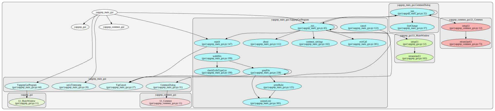

# yapygrep

A Python 3 file grepper like UniversalCodeGrep [ucg](https://github.com/gvansickle/ucg) or [ripgrep](https://github.com/BurntSushi/ripgrep)

## Design
* Overview
    * Text GUI with graphical options
    * Multiprocessor  -- Craig
    * Regex  -- Peter
    * Dir/File tree searching -- Kevin

* [PyQt5](https://www.riverbankcomputing.com/news) GUI
    * if cmdline argst then GUI pops-up and search runs (-g) else GUI starts and waits for user input

* Usage
    * yapygrep [switches] pattern [files/dirs ...]
    
* Switches (ripgrep/ucg like)
    * --gui=yes/no switch??
    * -g       Implicitly push the search button
    * -t FTYPE Specify filetypes for search
    * -r       Recurse (default)
    * -n       No recurse
    * -h       Help
    * --help-types	Print file types and exit
    * -i       Ignore case of search term
    * -l       Line Number
    * -c       Column Number
    * -S       Smartcase search
    * --raw    output without HTML formatting
    
## Modules
* regex

## Interpreter
* [pypy](https://pypy.org) if it works in PyQt5

## Call Graph

